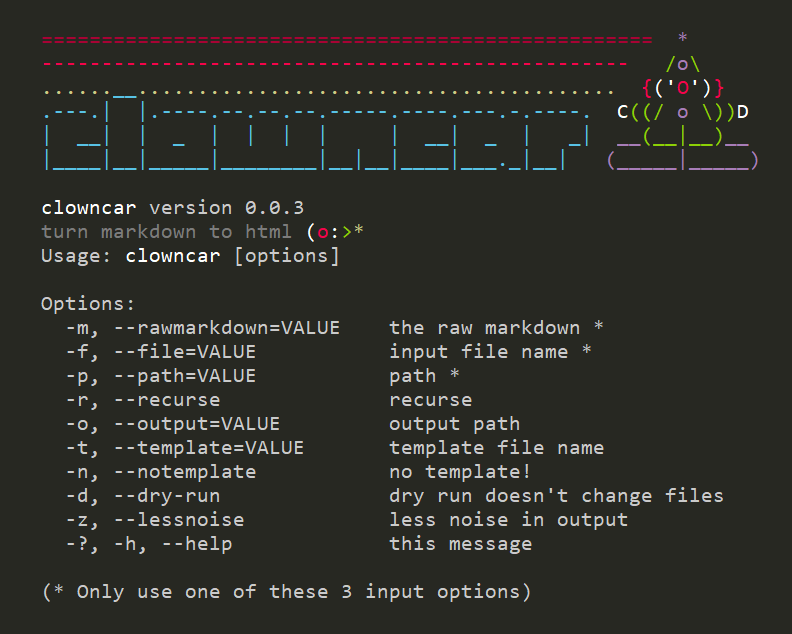

# Clowncar: .net core static website builder

🚗🤡🤡🤡🤡🤡🤡🤡 *infinite clowns emerge from a tiny car!*

Clowncar generates a static html website, from a folder full of markdown files, using very simple templates.

Clowncar is a .net core console app. It can be compiled for Windows or Linux.

(Currently it is only tested on Windows, and I know there will be a few bugs on Linux, related to case-sensitivity and slashes versus back slashes. Linux isn't my priority at the moment, but pull-requests are very welcome!)

The markdown conversion is provided by [markdig](https://github.com/lunet-io/markdig) which is based on commonmark and has a lot of [interesting extensions](https://github.com/lunet-io/markdig#features).

## Help

    > .\clowncar.exe -?
    clowncar version 0.0.3
    Turn markdown to html.

    Usage: clowncar [options]

    Options:
        -m, --rawmarkdown=VALUE    the raw markdown *
        -f, --file=VALUE           input file name *
        -p, --path=VALUE           path *
        -r, --recurse              recurse
        -o, --output=VALUE         output path
        -t, --template=VALUE       template file name
        -n, --notemplate           no template!
        -d, --dry-run              dry run
        -z, --lessnoise            less noise in output
        -?, -h, --help             this message

    (* Only use one of these 3 input options)

## Examples

### Simplest possible example

You can use it to just convert raw markdown into html:

    .\clowncar.exe --rawmarkdown="**Hello world!**"

Result:

    
<strong>Hello world!</strong>

And, when using the `--rawmarkdown` parameter, you can use the literal string `\n` in your markdown to indicate new lines, so that a "one-liner" can have multiple lines.

For example this input:

    .\clowncar.exe --rawmarkdown="**Hello world!**\n\n**new paragraph**"

...produces this result:

    
<strong>Hello world!</strong>

    
<strong>new paragraph</strong>

### Convert a single file to html (with default template or no template)

    .\clowncar.exe --file="example.md"

Assuming there is a file called `example.md` in the local folder, there will now also be a file called `example.html` that uses the in-built [default template](default-template.md)

And you will see output in the console such as:

    ~~> .\example.html 508 chars, defaultTemplate

To force it to use no template at all (i.e. just save the converted markdown, not wrapped inside a html page) use the `--notemplate` flag

    .\clowncar.exe --file="example.md" --notemplate

### A brief explanation of templates....

Before showing examples with templates, I must say a word about templates: **Basic**. They are *really* basic, as you will see.

By long-standing tradition, template files used by clowncar have the `.clowntent` extension. The reasons for this are lost to history. You don't need to follow the convention.

A template is just a plain `html` file, but with these two special tokens embedded somewhere inside, which will be replaced at go time:

 * `{{body}}` &mdash; Put this token where you want the generated HTML to go.
 * `{{title}}` &mdash; The title of the document, which will be based on the name of the markdown file (with underscores replaced by spaces)

There are no other fancy features or capabilities in the template language. It's not even a language, just a literal file with two tokens that get replaced. That's it.

### Example of using a template

You can specify a template from the command line:

    .\clowncar.exe --file="example.md" --template="template.clowntent"

Now, instead of using the built-in default template, it will use the template file you have specified.

### Example of building an entire site with your own template

All of the above is just pre-amble. Here is how you are really intended to use clowncar -- to build an entire site.

Some suggestions:

* You should specify an `--output` path, so that the results ends up somewhere other than intermingled with the markdown.
* You should use the `--recurse` parameter if you have lots of subfolders that need to be generated as well.
* You should use your own custom `--template`

      .\clowncar.exe --path="~\my-notes" --output="~\my-website" --template="template.clowntent" --recurse

You'll see 1 line of output from clowncar about every single file it encounters. There are a few different lines you'll see:

Here's is an example of each type of output:

    ~~> example.html 1666 chars, template: template.clowntent
    ++> screenshot.jpg
    xx> (skipped) example.html

The meanings of each type of output are based on the first few characters, to wit:

 * `~~>` is used for a file that was generated
 * `++>` is used for a file that was copied to the output path. All files are copied except a few types: `.md`, `.html`, `.clowntent`, `.pre`, `.ok`, `.ps1`.
 * `xx>` is used for a file that is skipped -- it is not copied to the output path. In addition to the types listed above, clowncar skips any content nested under a ".git", ".hg", "node_modules", or "_book" folder.

(Note that copying of files will only happen if an "output path" (`--output`, `-o`) is specified.)

## Want less *noise* from the console?

Because *many* files are skipped (particularly if there are `.git` or `node_modules` folders present) the console output can be quite noisy.

Use the *Be Less Noisy Please* Parameter (`--lessnoise` or `-z`) to stop clowncar from telling you about the files it has skipped.

It will still tell you about the files it generated, and the files it copied.

To produce no output, redirect both standard and error streams to null, e.g.

    .\clowncar.exe -p="~\my-notes" -o="~\my-website" -t="template.clowntent" -r 2>&1 | out-null

...or, equivalent:

    .\clowncar.exe -p="~\my-notes" -o="~\my-website" -t="template.clowntent" -r 2>&1> $null

### How to be safe... use `--dry-run`

There is also an option called "dry run" (`--dry-run` or just `-d`) that will stop `clowncar` from actually writing/changing/copying any files.

Instead, it will just show you what it *would* have done. (This is similar to the `-whatif` convention from Powershell, or the `--dry-run` flag in Angular)

The messages sent to the console are the same, except that every line of text has `(dry-run)` before it. So for example you might see:

    (dry-run)~~> example.html 1666 chars, template: template.clowntent
    (dry-run)++> screenshot.jpg
    (dry-run)xx> (skipped) example.html

When the `--dry-run` flag is set, none of the actions are actually performed.

Our example above would become:

    .\clowncar.exe --path="~\my-notes" --output="~\my-website" --template="template.clowntent" --recurse --dry-run

To make no changes and see *no* output you could use:

    .\clowncar.exe --path="~\my-notes" --output="~\my-website" --template="template.clowntent" --recurse --dry-run 2>&1> $null

...or just don't run *any* command.

## Live Demonstration

Here's a website I built using clowncar:

 * **[til.secretgeek.net](https://til.secretgeek.net)** &mdash; website built with clowncar, based on [these markdown files](https://github.com/secretGeek/today-i-learned-staging)

Clowncar was originally created for the sole purpose of re-building my 'today-i-learned' website, my own way.

## What's next?

I am not sure. I need to add a contributing file, blog about it, add some more features, survive this global pandemic, get my life in order. Y'know... the usual.

### Proposed feature:  pack the entire clowncar tool into a single self-contained executable/binary

Currently the build does *not* pack the entire clowncar tool into a single self-contained executable/binary. I will do that once it becomes a standard part of .net core, soonish. (I'm not going to use one of those existing assembly weavers such as [fody](https://github.com/Fody/Fody) though they do sound interesting.)

### Proposed feature: well known themes

I'd like to have some well-known-themes/templates that clowncar can applied. A list of available themes would be discovered by checking: `clowntown.secretgeek.net/themes/` (for example) and if you say `clowncare.exe --famous-theme=minimal-dark` then it will ask `clowntown.secretgeek.net/themes/minimal-dark/` for a list of all files used by this theme, and then it will download them (including their relative paths), for use by the generator. Ideally the themes would be a very simple file-based collection, that people can contribute to sending pull requests to a git repo, hosted by github pages.

### Proposed feature: fancy templates

What good is a clown that can't juggle?? The templating language is not currently a language. I could switch it up by using the asp.net core `razor` templating language, or some kind of javascript interpreted nonsense. Model info could be embedded in a document by using YAML front matter.

## About the ascii-art in the console output

What was I thinking! 

                           ============================  *
                        -----------------------------   /o\
          __          ..............................  {('O')}
    .---.|  |.----.--.--.--.-----.----.---.-.----.  C((/ o \))D
    |  __|  |  _  |  |  |  |     |  __|  _  |   _|  __(__|__)__
    |____|__|_____|________|__|__|____|___._|__|   (____/ \____)

The AsciiFont is from here --  http://patorjk.com/software/taag/#p=testall&f=Alpha&t=clowncar

...and creating that just serves to remind me that *I friggin' hate clowns!*

Maybe I should've just gone with the emoticon.

`*<:o)`

